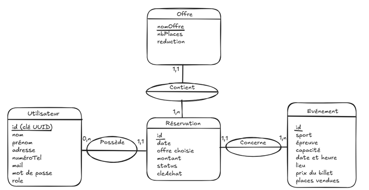

# Documentation Technique - Billetterie JO 2024

## Sommaire
1. [Présentation du projet](#1-présentation-du-projet)
2. [Architecture technique](#2-architecture-technique)
3. [Modèle de données](#3-modèle-de-données)
4. [Fonctionnalités](#4-fonctionnalités)
5. [Tests et qualité](#5-tests-et-qualité)
6. [Déploiement](#6-déploiement)
7. [Évolutions futures](#7-évolutions-futures)

---

## 1. Présentation du projet

### Contexte
Application web de réservation et distribution de billets pour les Jeux Olympiques 2024, développée dans le cadre du projet Bachelor Développeur d'Application Java (STUDI).

### Objectifs
- Permettre la consultation des offres et événements
- Gérer la réservation de billets personnalisée
- Générer des QR codes sécurisés pour chaque billet
- Fournir un tableau de bord administrateur pour le suivi des ventes

### Public cible
Cette documentation s'adresse aux développeurs, testeurs et parties prenantes techniques du projet.

### Liens utiles
- **Application déployée** : https://billetterie-jo-studi-misty-silence-7900.fly.dev/
- **GitHub** : https://github.com/Pierregris/Billetterie_JO_Studi.git
- **Trello** : https://trello.com/invite/b/68c2a8edf11d5a7c22e9f518

---

## 2. Architecture technique

### Stack technologique

#### Frontend
- **Templates** : Thymeleaf (HTML + Bootstrap)
- **Scripts** : JavaScript (réactivité et dynamisme)

#### Backend
- **Framework** : Java Spring Boot
- **Sécurité** : Spring Security avec authentification à deux facteurs (2FA)
- **Cryptage** : BCrypt pour les mots de passe
- **OTP** : One Time Password envoyé par email (validité 5 min)

#### Base de données
- **Type** : Relationnelle SQL (MariaDB)
- **ORM** : Spring Data JPA

#### Infrastructure
- **Hébergement** : Fly.io
- **Sessions** : Redis (persistance des sessions)
- **Gestion de projet** : Trello
- **Versioning** : Git / GitHub

---

## 3. Modèle de données

### Schéma conceptuel
Le modèle repose sur 4 entités principales interconnectées.



### Entités

#### Utilisateur
| Attribut | Type | Description |
|----------|------|-------------|
| id | UUID | Clé unique générée à la création (utilisée pour le QR code) |
| nom | String | Nom de famille |
| prenom | String | Prénom |
| email | String | Identifiant de connexion (unique) |
| telephone | String | Numéro de téléphone |
| adresse | String | Adresse postale complète |
| motDePasse | String | Mot de passe crypté (BCrypt) |
| role | Enum | ADMIN, USER ou PRE_AUTH |
| active | Boolean | Compte activé via email |
| otp | String | Code de validation 2FA |
| otpValidity | LocalDateTime | Date d'expiration de l'OTP |

**Politique de sécurité du mot de passe** : minimum 10 caractères, dont au moins 1 majuscule, 1 chiffre et 1 caractère spécial.

#### Réservation
| Attribut | Type | Description |
|----------|------|-------------|
| id | Long | Identifiant auto-incrémenté |
| status | Enum | PANIER, EXPIREE ou FINALISEE |
| validite | LocalDateTime | Date limite de validité (1h après ajout au panier) |
| montant | Float | Montant total en € |
| offre | Offre | Offre sélectionnée |
| cleAchat | UUID | Clé unique générée à l'achat |
| utilisateur | Utilisateur | Propriétaire de la réservation |
| evenement | Evenement | Événement réservé |

**Cycle de vie** :
- **PANIER** : réservation non payée (visible dans le panier)
- **EXPIREE** : délai de 1h dépassé ou suppression manuelle
- **FINALISEE** : paiement validé (visible dans "Mes réservations")

#### Événement
| Attribut | Type | Description |
|----------|------|-------------|
| id | Long | Identifiant auto-incrémenté |
| sport | String | Discipline sportive |
| nomEvenement | String | Nom descriptif (ex: "France-USA", "Finale H") |
| date | LocalDate | Date de l'événement |
| heure | LocalTime | Heure de début |
| lieu | String | Lieu de l'événement |
| capaciteMax | Integer | Capacité maximale d'affluence |
| billetsVendus | Integer | Nombre de billets vendus |
| prixBillet | Float | Prix unitaire du billet |

#### Offre
| Attribut | Type | Description |
|----------|------|-------------|
| nomOffre | String | Nom de l'offre (ex: "Duo", "Familiale") |
| reduction | Float | Coefficient de réduction (ex: 0.95 = -5%) |
| nbPlaces | Integer | Nombre de places incluses |
| active | Boolean | Offre visible et réservable |

---

## 4. Fonctionnalités

### 4.1 Gestion des comptes

#### Création de compte

**Contrôleur** : `UtilisateurController`  
**Endpoints** :
- `GET /register` : affichage du formulaire
- `POST /register` : traitement de l'inscription

**Processus** :
1. Saisie des informations personnelles (nom, prénom, email, mot de passe, adresse)
2. Validation des champs (tous obligatoires)
3. Vérification de l'unicité de l'email
4. Cryptage du mot de passe (BCrypt)
5. Création de l'utilisateur avec `active = false` et `role = USER`
6. Génération d'un token d'activation (UUID)
7. Envoi d'un email avec lien de validation
8. Activation du compte via le lien (passage de `active` à `true`)

**Service** : `EmailService` pour l'envoi de mail  
**Repository** : `UtilisateurRepository` pour la persistance

#### Connexion sécurisée (2FA)

**Contrôleur** : `UtilisateurController`  
**Endpoints** :
- `GET /login` : formulaire de connexion
- `POST /login` : authentification (géré par Spring Security)
- `GET /2fa` : page de saisie OTP
- `POST /2fa` : validation du code

**Processus** :
1. **Première couche** : saisie email + mot de passe
   - Si valide → attribution du rôle `PRE_AUTH`
   - Génération d'un OTP de 6 caractères (chiffres/lettres majuscules)
   - Envoi de l'OTP par email (sauf pour compte admin)
   - Stockage de l'OTP et de sa date de validité (5 min) en base

2. **Seconde couche** : saisie de l'OTP
   - Vérification de la correspondance avec l'utilisateur connecté
   - Vérification de la validité temporelle
   - Si valide → attribution du rôle `USER` et accès complet

**Configuration Spring Security** :
```java
.formLogin(formLogin -> formLogin
    .loginPage("/login")
    .usernameParameter("mail")
    .authenticationDetailsSource(authenticationDetailsSourceConfig)
    .successHandler(twoFASuccessHandler))
```

**Handler** : `TwoFactorAuthenticationSuccessHandler` gère la redirection vers `/2fa`

### 4.2 Billetterie

#### Consultation des offres

**Contrôleur** : `BilletterieController`  
**Vues** : `accueilbilletterie.html`, `pagesport.html`

**Fonctionnement** :
1. Page d'accueil : affichage de tous les sports disponibles
2. Sélection d'un sport → redirection vers `/pagesport?sport={nomDuSport}`
3. Affichage des événements à venir pour ce sport avec :
   - Date, heure et lieu
   - Alerte si < 100 places restantes
   - Message "Complet" avec option liste d'attente si plus de places
   - Bouton de réservation ouvrant une modale

**Modale de réservation** :
- Affichage des offres disponibles
- Masquage automatique des offres incompatibles avec le nombre de places restantes
- Sélection et ajout au panier direct

#### Gestion du panier

**Contrôleur** : `ReservationRestController`  
**Vue** : `panier.html`

##### Ajout au panier
**Endpoint** : `POST /ajouteraupanier`

**Processus** :
1. Création d'une nouvelle réservation avec `status = PANIER`
2. Attribution d'une validité de 1 heure
3. Association de l'offre, événement et utilisateur
4. Mise à jour du nombre de places disponibles
5. Affichage d'un message de confirmation
6. Vérification automatique de l'expiration toutes les 60s (JavaScript)

##### Affichage du panier
**Endpoint** : `GET /panier`

Affichage pour chaque réservation :
- Informations détaillées
- Compteur de validité
- Bouton de suppression
- Récapitulatif avec montant total (calculé en JavaScript)

##### Suppression du panier
**Endpoint** : `POST /supprimerdupanier`

Utilisé pour :
- Suppression manuelle par l'utilisateur
- Expiration automatique de la réservation

Actions :
- Passage du status à `EXPIREE`
- Remise en vente des places
- Mise à jour de l'affichage

#### Paiement et validation

**Contrôleur** : `ReservationRestController`  
**Vue** : `commande.html`  
**Endpoint** : `POST /paiement`

**Processus** :
1. Vérification finale de la validité des réservations du panier
2. Simulation de paiement avec :
   - Numéro de carte (5 chiffres minimum)
   - Nom (non vide)
   - Code de sécurité (3 chiffres)
3. Délai de traitement simulé (5 secondes)
4. En cas de succès :
   - `POST /validerPanier` : passage des réservations à `FINALISEE`
   - `POST /creerlesclesachat` : génération des clés UUID pour chaque réservation
5. Redirection vers page de confirmation

**Méthode de simulation** :
```java
@PostMapping("/paiement")
public boolean simulerPaiement(@RequestBody @Valid InfosPaiementDTO infosPaiementDTO) 
    throws InterruptedException {
    Thread.sleep(5000);
    return true;
}
```

#### Visualisation des billets

**Vue** : `moncompte.html`  
**Endpoint** : `POST /genererqrcode`

Affichage :
- Carte pour chaque réservation finalisée
- Bouton d'affichage du QR code

**Génération du QR code** :
- Concaténation : `cleAchat + utilisateur_id`
- Format : Base64
- Bibliothèque : ZXing
- Taille : paramétrée (width, height)

```java
public String genererQRCode(UUID cleAchat, UUID utilisateur_id, int width, int height) {
    try {
        return qrCodeService.generateQRCodeBase64(
            width, height, 
            cleAchat.toString() + utilisateur_id.toString()
        );
    } catch (WriterException | IOException e) {
        return e.toString();
    }
}
```

### 4.3 Espace administrateur

**Identifiants de test** :
- Email : `admin@admin.fr`
- Mot de passe : `admin`

#### Création d'événement

**Contrôleur** : `EvenementController`  
**Vue** : `creerEvenement.html`  
**Endpoint** : `POST /creerEvenement`

**Champs requis** :
- Sport
- Nom de l'événement
- Date et heure
- Lieu
- Capacité maximale
- Prix du billet

**Initialisation** : `billetsVendus = 0`

#### Consultation des ventes

**Vue** : `consulterEvenement.html`  
**Affichage** : Liste de tous les événements avec :
- Jauge de remplissage (billetsVendus / capaciteMax)
- Indication "Complet" si nécessaire
- Statistiques en temps réel

#### Gestion des offres

**Contrôleur** : `OffreController`

##### Création d'offre
**Vue** : `creerOffre.html`  
**Endpoint** : `POST /creerOffre`

**Champs** :
- Nom de l'offre
- Nombre de places
- Réduction (coefficient)

**Initialisation** : `active = true`

##### Activation/Désactivation
**Vue** : `gereroffres.html`  
**Endpoints** :
- `POST /admin/activeroffre` : `active = true`
- `POST /admin/desactiveroffre` : `active = false`

**Effet** : Visibilité immédiate dans la billetterie

---

## 5. Tests et qualité {#tests}

### Stratégie de test

Tests unitaires sur :
- Tous les contrôleurs (Billetterie, Utilisateur, Événement, Réservation)
- Toutes les classes de service

**Objectif de couverture** : 80% pour services et contrôleurs

### Résultats de couverture

| Module | Instructions | % Coverage | Branches | % Branches | Méthodes | % Méthodes |
|--------|--------------|------------|----------|------------|----------|------------|
| **Total** | 394 / 1 731 | **77%** | 12 / 26 | 53% | 41 / 201 | 20% |
| Configuration | 8 / 177 | 44% | 0 / 15 | 0% | 4 / 57 | 7% |
| Controller | 23 / 92 | **83%** | 8 / 43 | **83%** | 1 / 5 | 20% |
| POJO | 18 / 48 | **85%** | N/A | N/A | 0 / 133 | 0% |
| ServiceImpl | 9 / 28 | **92%** | 6 / 34 | 66% | 1 / 7 | 14% |
| DTO | 10 / 2 | 66% | N/A | N/A | 1 / 30 | 3% |
| Status | 4 / 857 | **87%** | N/A | N/A | 0 / 14 | 0% |

**Note** : Les classes de configuration (externes à Spring Boot) ne sont pas explicitement testées.

---

## 6. Déploiement {#déploiement}

### Plateforme
Déploiement via **Fly.io**. Référez-vous à la documentation officielle pour la procédure détaillée.

### Variables d'environnement

#### Base de données
```bash
DB_URL=<url_base_de_donnees>
DB_USERNAME=<identifiant_connexion>
DB_PASSWORD=<mot_de_passe_connexion>
```

#### Service mail
```bash
MAIL_USERNAME=<identifiant_compte_mail>
MAIL_PASSWORD=<mot_de_passe_application>
```

#### Sessions Redis
Création de l'app Redis :
```bash
fly apps create nom_redis
fly redis create --name nom_redis
```

Variables :
```bash
REDIS_HOST=<url_app_redis>
REDIS_PORT=<port_redis>
REDIS_PASSWORD=<mot_de_passe>
```

#### Application
```bash
APP_BASE_URL=<url_base_application>
```
(Utilisée notamment pour les liens de validation par email)

### Dockerfile

```dockerfile
FROM maven:3.9.5-eclipse-temurin-21 AS build
WORKDIR /app
COPY pom.xml .
COPY .mvn .mvn
COPY mvnw .
COPY src ./src
RUN ./mvnw clean package

FROM eclipse-temurin:21-jdk
WORKDIR /app
COPY --from=build /app/target/billeterie-jo-2024-0.0.1-SNAPSHOT.jar app.jar
EXPOSE 8081
ENTRYPOINT ["java", "-Duser.timezone=Europe/Paris", "-jar", "app.jar"]
```

---

## 7. Évolutions futures {#évolutions}

### API de paiement réelle
Intégration de solutions comme **Stripe** ou **PayPal** pour remplacer la simulation actuelle et permettre de vraies transactions.

### Amélioration de l'espace administrateur

#### Gestion complète des événements
- **Modification** : dates, lieux, prix
- **Suppression** : avec gestion des réservations existantes
- **Notifications** : alertes automatiques aux utilisateurs en cas de changement

#### Entité Lieu
Création d'une nouvelle entité pour :
- Associer automatiquement la capacité maximale au lieu
- Éviter la saisie manuelle répétitive
- Garantir la cohérence des données

#### Tableau de bord enrichi
- Filtres par sport, date, taux de remplissage
- Graphiques et statistiques avancées
- Export des données de vente

### Application mobile
Développement d'une app native pour :
- Consultation optimisée des billets sur smartphone
- Affichage rapide des QR codes
- Notifications push (rappels d'événements, offres spéciales)
- Expérience utilisateur mobile-first

### Internationalisation
- Interface multilingue (minimum français/anglais)
- Gestion des devises multiples
- Adaptation aux fuseaux horaires
- Formats de dates et adresses localisés

### Fonctionnalités supplémentaires
- **Liste d'attente fonctionnelle** : notification automatique en cas de désistement
- **Transfert de billets** : entre utilisateurs avec traçabilité
- **Programme personnalisé** : suggestions basées sur les préférences
- **Intégration calendrier** : ajout automatique des événements réservés

---

*Documentation générée pour le projet Bachelor Développeur d'Application Java - STUDI*  
*Dernière mise à jour : Octobre 2025*